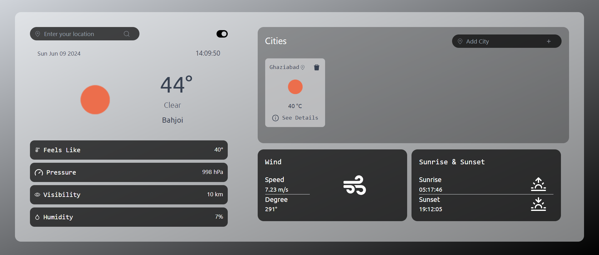
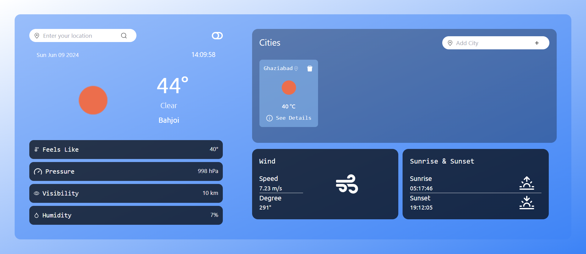
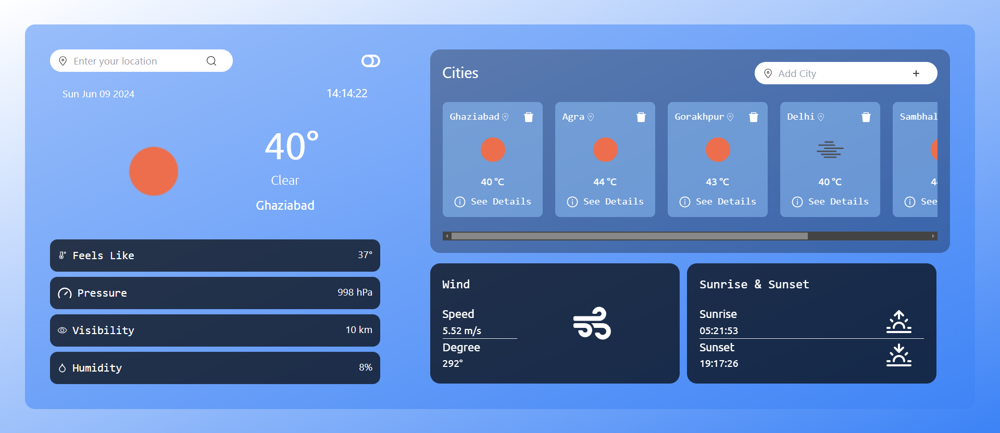

# Weather Dashboard



This project is a weather dashboard built with React.js. It allows users to search for weather information of different cities and view various weather parameters such as temperature, humidity, wind speed, sunrise, sunset, etc.

## Features

- **City Search**: Users can search for weather information of any city.
- **Current Weather Display**: Display current weather conditions including temperature, weather description, and icon.
- **Additional Weather Parameters**: View additional weather parameters such as feels like temperature, pressure, visibility, humidity, wind speed, wind degree, sunrise time, and sunset time.
- **Theme Toggle**: Toggle between light and dark themes.
- **City Tracking**: Add multiple cities to track their weather information.
- **Responsive Design**: Seamlessly usable on different devices.

## Screenshots




## Installation

To run this project locally, follow these steps:

1. Clone the repository:

   ```bash
   git clone https://github.com/dhirajkumar0/weather-app.git
   
2. Navigate to the project directory:
   ```bash
   cd weatherapi
3. Install dependencies:
   ```bash
   npm install
4. Start the development server:
   ```bash
   npm run dev
5. Open your web browser and visit http://localhost:5173 to view the application.

## Technologies Used

- **React.js**: A JavaScript library for building user interfaces, providing a component-based architecture.
- **Redux**: A predictable state container for JavaScript apps, used to manage the application state effectively.
- **Tailwind CSS**: A utility-first CSS framework for rapid UI development, enabling responsive and visually appealing designs.
- **OpenWeatherMap API**: An API used to fetch real-time weather data for various cities around the world.
- **React Icons**: A collection of popular icons to enhance the visual appeal and usability of the application.
- **Date**: JavaScript's Date object is used to manage and display the current time and date.
- **Local Storage**: Web Storage API's localStorage is used to persist the list of cities across sessions.

## Known Issues or Limitations

- **API Limits**: The application is subject to the limitations of the OpenWeatherMap API, including rate limits and data accuracy.
- **Temperature Conversion**: The application currently uses a simple conversion from Kelvin to Celsius, which might need improvements for more precise temperature values.
- **City Validation**: There is minimal validation for city names entered by users, which may result in incorrect or invalid API requests.


## Contributing

Contributions are welcome! If you find any bugs or have suggestions for improvements, feel free to open an issue or submit a pull request.
